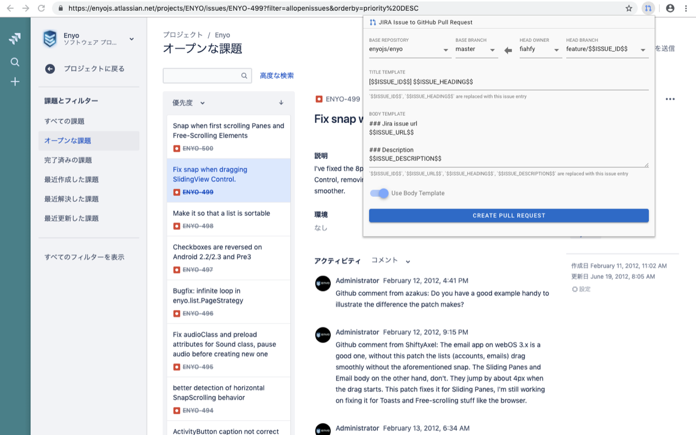

# jira-issue-to-github-pr

[](https://travis-ci.com/fiahfy/jira-issue-to-github-pr)

> WIP

## Features

- WIP

## Screenshots



## Installation

1. Download `archive.zip` from [releases page](https://github.com/fiahfy/jira-issue-to-github-pr/releases) and unzip this file.
2. Open the Extension Management page by navigating to `chrome://extensions`.
3. Enable Developer Mode by clicking the toggle switch next to **Developer mode**.
4. Click the **LOAD UNPACKED** button and select the unpacked directory named `app`.

## Development

```bash
# install dependencies
yarn

# watch files changed and reload extension
yarn dev
```
